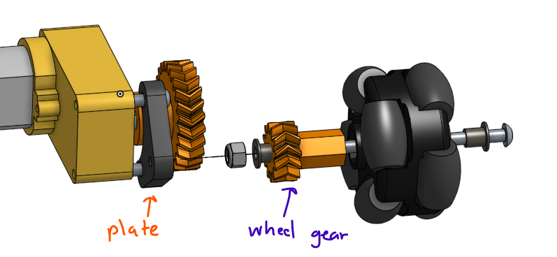
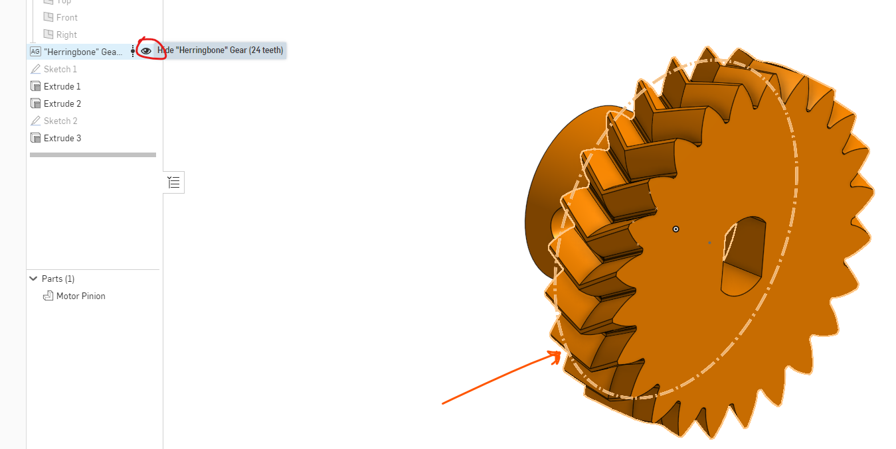
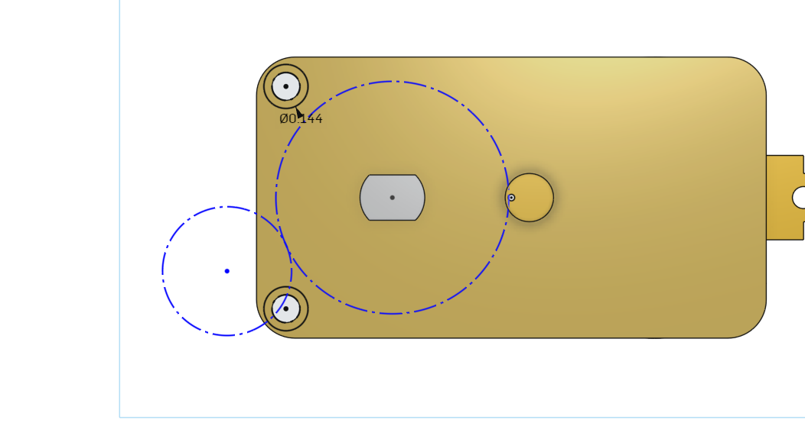
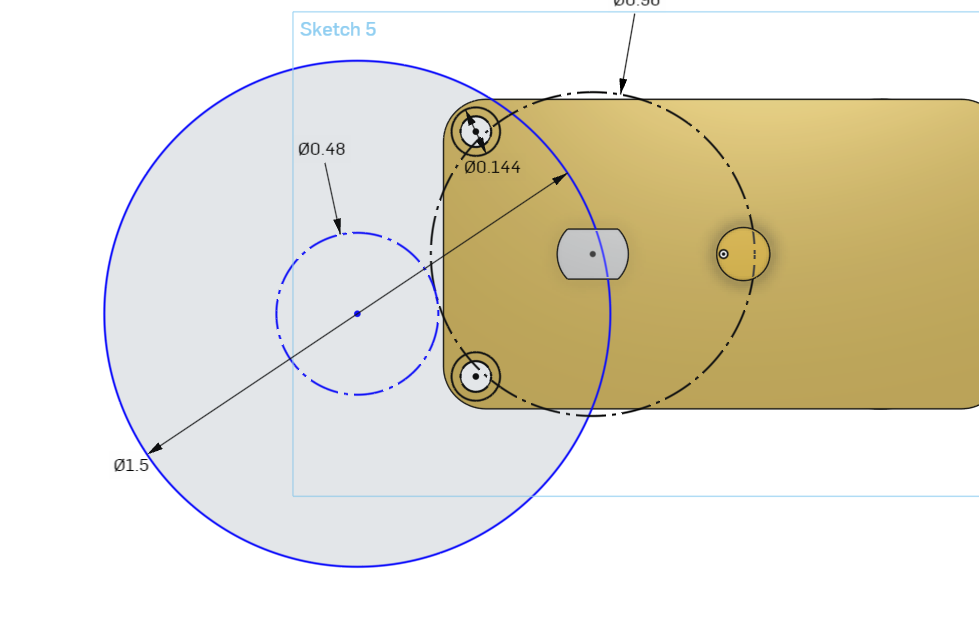
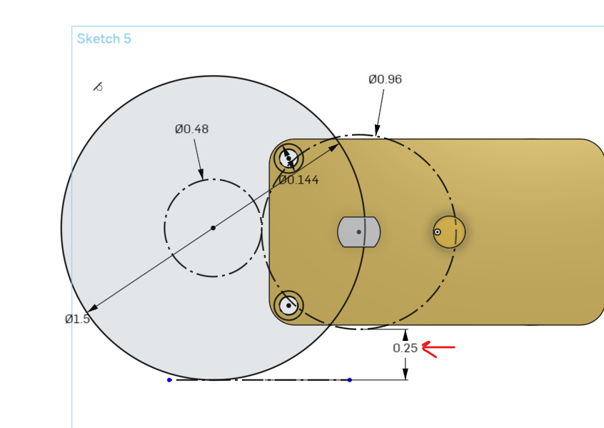
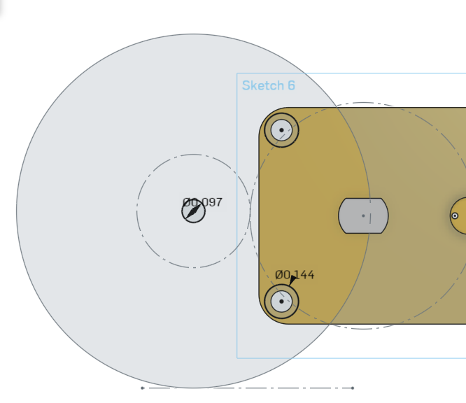
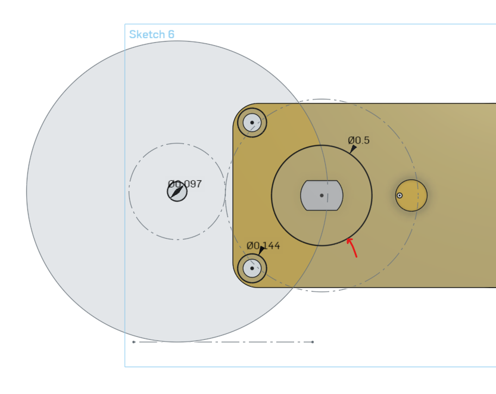
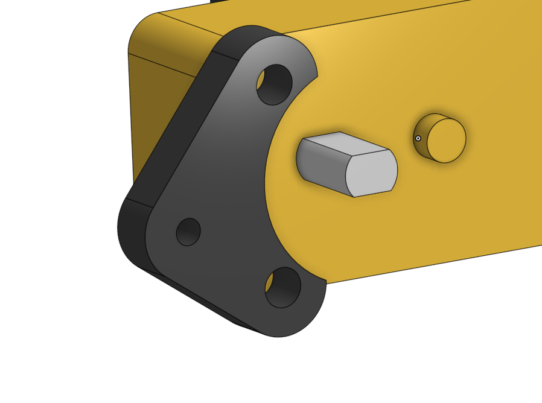
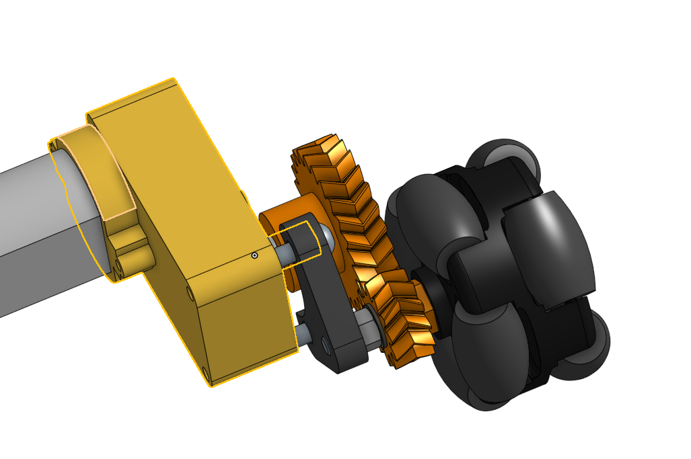

# 

---

title: Omni Car Project

date: 2022-07-20T00:15:38.963Z

description: A cute tank drive car suitable for drifting

---

# About Omni Car Project

By: MingWei Yeoh

It's a tank driven car with omni wheels for some sick drifting without the fear of shredding the floor! Combined with a responsive FLYSKY Drone Transmitter, this makes for a fun project!

## Challenges

### CAD

The main gripe with the included motors in the kit is that they are a little slow. Thus we will be making a **custom 1:2 speed gearbox** with OnShape in order to speed up the drive wheels!

[Answer Key Onshape Files](https://cad.onshape.com/documents/2a7f4b08169f040265235880/w/c5c7e57ba2de3b115485b33c/e/ef8e0e6003989cb6d29842b7?renderMode=0&uiState=62ddffa3c7666d2b45aa2f62)

[Student copy of Onshape Files](https://cad.onshape.com/documents/30ea8b3deb0b2951b3a9324d/w/0cbcffa2c3bcbcb2279b8d0f/e/87097186b0e86bcb26d61ab0?renderMode=0&uiState=62de03ed7d3ab54cc104de80)

### Electronics

Electronics aren't that complicated. We use 3 wires to wire the drone receiver to the Arduino Mega and wire up all the motors to the Adafruit Motor shield. Some basic soldering of the header pins onto the Motor Shield is required.

## Code

Code is extremely basic and can be found in the omniwheelcar.ino file. The most important things are to install the I-Bus communcation library for the controller in order to get the joystick data.

## Materials

- 1.5" [Omni Wheels]([38mm (1.5 inches) Double Plastic Omni Wheel with 8 PU Rollers – The Smallest Omni Wheel – 14184 – Oz Robotics](https://ozrobotics.com/shop/38mm-1-5-inches-double-plastic-omni-wheel-with-8-pu-rollers-the-smallest-omni-wheel-14184/?gclid=Cj0KCQjwuO6WBhDLARIsAIdeyDKZsAJRbve_n7XOvtvnNeYBl4DtJMTloGh_OklkEDbuxJY_HlO5m5IaAm7hEALw_wcB))

- [DAGU Robot](http://www.dagurobot.com/DG012-BV)

- [Adafruit motor Driver Shield]([Motor Stepper Servo Shield 1438 Adafruit Industries | Jameco](https://www.jameco.com/z/1438-Adafruit-Industries-Adafruit-Motor-Stepper-Servo-Shield-for-Arduino-Kit-v2-3_2193651.html?CID=GOOG&gclid=Cj0KCQjwuO6WBhDLARIsAIdeyDIM6RLzXcTHU6YzXxPacGYE7HdH5P8kUolKOkncQIB1xLzhVvg549waAixxEALw_wcB))

- [Arduino Mega](https://www.amazon.com/dp/B01H4ZDYCE/ref=twister_B091DSB8HY?_encoding=UTF8&psc=1)

- [FLYSKY Transmitter & Reciever](https://www.amazon.com/Transmitter-Controller-Receiver-Helicopter-Quadcopter/dp/B07Z9YNP7S/ref=sr_1_3_sspa?crid=22XSBST19C0DK&keywords=flysky+receiver&qid=1658602756&sprefix=flysky+receiver%2Caps%2C136&sr=8-3-spons&psc=1&smid=A27Y3358ST3KOY&spLa=ZW5jcnlwdGVkUXVhbGlmaWVyPUExQjc0MzhVQUJYMjBNJmVuY3J5cHRlZElkPUEwMDI3NTY1MzdBN0M4N1RSRFhFMCZlbmNyeXB0ZWRBZElkPUEwMjYyNzAxMzBOTks4R0RBVzBLViZ3aWRnZXROYW1lPXNwX2F0ZiZhY3Rpb249Y2xpY2tSZWRpcmVjdCZkb05vdExvZ0NsaWNrPXRydWU=)

- [M3 Lock Nuts](https://www.amazon.com/100Pcs-Stainless-Self-Lock-Inserted-Clinching/dp/B075ZZW7VL/ref=sr_1_3?crid=3GPHXEXC6OMTA&keywords=m3+locknuts&qid=1658603323&sprefix=m3+lock+nut%2Caps%2C142&sr=8-3)

- [M4 Grub Screws](https://www.amazon.com/uxcell-50Pcs-Socket-Screws-Headless/dp/B01N76NKU6/ref=sr_1_11?crid=MTNXL2QJU032&keywords=m4+grub+screw+black&qid=1658603365&sprefix=m4+grub+screw+blac%2Caps%2C119&sr=8-11)

- [M3 Hobby Park Bushings]([Redcat Racing 02101 C-hub Bushings King Pin Bushings 12pcs 02101 609132454745 | eBay](https://www.ebay.com/itm/232912178821?_trkparms=amclksrc%3DITM%26aid%3D111001%26algo%3DREC.SEED%26ao%3D1%26asc%3D20160908105057%26meid%3D7fbbb6b6af374b59be0eed56975e28ac%26pid%3D100675%26rk%3D1%26rkt%3D15%26sd%3D232912178821%26itm%3D232912178821%26pmt%3D1%26noa%3D1%26pg%3D2380057%26brand%3DRedcat+Racing&_trksid=p2380057.c100675.m4236&_trkparms=pageci%3A8a3100ac-0abc-11ed-b9b9-ca517b2aaa65%7Cparentrq%3A2c8131cd1820a60c03759435ffe81b36%7Ciid%3A1))

- Assorted M3 Bolts

# Getting Started MAE Terms

## Bushing

For spinning objects, it is good practice to use a bushing (Which is basically a cheap bearing) instead of simply spinning an object on a bolt. They are typically made of a low friction material like bronze.

*Image of a bushing*

## Through Hole

Hole that is meant for a bolt to pass through without interference. I usually use a value = (OD of bolt)" + 1/32"

## Tap Hole

Hole that is meant for a bolt to thread through it and essentially act like a nut (but without a nut, they're really convenient). It is important to understand that you can only use this with **3D Printing** as the plastic will form it's own threads naturally. The pullout force is quite strong but it does not take much torque to strip the threads so you must be carefull of overtightening.

I use a value of (OD of a bolt)" - 1/64"

## Tolerance

Anything that we 3D Printing to fit around something "snuggly" must have a little bit of tolerance on it. If we make a hole exactly the size of the motor shaft, it will probably not fit and be **WAAAY** too tight, therefore we add a little bit **extra** called Tolerance.

There is quite an easy way to achieve this.

1. Copy over the geometry of the Motor Shaft (**MS**).

2. Click on all of the lines and select "Construction" (Or press q on keyboard to toggle)

3. Click on the offset button and offset it by 1/128" This new line will be the **Actual geometry** that you use to fix the part around the motor shaft. (This value works for my printer but your results may vary)

## Gears

### Gear Types

There are different types of gears that we can 3D Print!

**Spur Gear** (Left)

**Helical Gear** (Middle)

**Herringbone Gear** (Right)

### Spur Gear

You are probably most used to the gear on the left, that's because they are easy to make and generally the least pain in the ass to use.

Some disadvantages of them include that you have to constrain the gears in the axial direction. They can slide off each other unless you prevent that from happening with another part. They also make anonying noises because there is not a consistent mating between the two faces that happen.

### Helical Gears

They fix the inconsistent mating problem with spur gears but because they are angled, they introduce their own problem of the gears themself wanting to push each other off of the axle. They create their own axial force lol. Cars use helical gears in their gearbox.

### Herringbone Gears

They are the best gears because of their coolness. They are basically helical gears mirrored against each other to form a herringbone gears. The axial force formed by the angled teeth cancel each other, which therefore makes no axial load. Additionally, they are self-aligning, they will literally "snap" into place and hold themself from sliding off one another.

You probably have never seen these gears in the real world because they are really hard to produce and most of the time you can get away with just a spur gear. 3D printers are like the only machine that can produce herringbone gears so you better take advantage of these cool things.

### Pitch diameter

The Pitch Diameter tells the mating distance for the gear and is crucial when you're making a gearbox. Like how else would you know the distance to where you should put the other end of the shaft??

## Layout sketch

This will be the most important when making the Gearbox plate. This will allow us to let **CAD **find out the positions **FOR US** for all of our axles. In my layout sketch example:

- The Pitch Diameters (**PD**) of both of the gears have a tangent relation to each other.

- I have drawn the **wheel** coaxially with it's respective gear to allow me to dimension how much ground clearance I want to have between the bottom of the Motor Pinion gear and the ground (**Brown exclamation mark**)

# CAD design

## Onshape File & Gear Setup

1. Make a copy of [Student copy of Onshape Files](https://cad.onshape.com/documents/30ea8b3deb0b2951b3a9324d/w/0cbcffa2c3bcbcb2279b8d0f/e/87097186b0e86bcb26d61ab0?renderMode=0&uiState=62de03ed7d3ab54cc104de80)

2. Open the file and click on the "+" button in the top-right corner to add a custom feature

3. Under "public" search for "Advanced Gear"

4. Add that featurescript to your toolbar

We will need to create 3 parts specifically in this order:

- **Motor Pinion Gear**
  
  - Will have Gear Teeth and a form of coupler to the shaft of the motor

- **Wheel Gear**
  
  - Have Gear Teeth and a form of coupler to the hub of the 1/5" Omni Wheel
  
  - Needs to have 1/2 the number of Gear Teeth that the Motor Pinion Gear has

- **Gearbox Plate**
  
  - This will hold attach the gear on the wheel to the chassis of the robot and most importantly will ensure a correct amount of spacing between the gears

## Creating the Motor Pinion Gear

1. Creat new Part Studio

2. Click on Advanced Gear in the top-right corner (The plugin you should've installed)

3. On the window that pops up, change from "Module" to "Diametrical Pitch"

4. Set the Number of gear teeth to 24

5. Set the Diametrical pitch to 25
   
   - Pitch Diameter = Number of Teeth / Diametrical Pitch
   
   - Diametrical Pitch relates to the density and size of the gear teeth

6. Change the type from "Spur" to Herringbone

7. Set Pressure Angle to 30 ( Just some number that I found that works well for 3D Printing)

8. Set Extrude Depth to 0.25"

9. Hit the check box.

Now it's up to you to attach this gear to the motor shaft!

> [!TIPS]

> Make sure to reference the reference motor in the part studio. It is under one of the tabs at the bottom of the screen. Reference the dimensions for the motor shaft and be sure to add **tolerance**!
> 
> In order to "secure" the gear pinion to the motor you should use a grub screw! Simply make a tap hole that goes straight into the shaft
> 
> 

## Creating the Wheel Gear

First we need to understand how this is all going to go together.

The part that we're going to make must have room for the **bushing **on the end of it and also fit inside of our **omni wheel**. 

The idea is that the wheel spins on a long bolt. A lock nut on the end of our wheel-gear assembly keeps everything tight and the entire bolt threads into the gearbox plate that we will make next. 

1) Create a new part studio

2) Make a new gear with:
- The Half the number of teeth as the first gear

- The **SAME DIAMERTICAL PITCH** (for some reason the DP changes whenever you change the teeth number, so just be aware of that)

- The same type of gear as the first one (herringbone, spur, or helical whatever you choose)

- 0.25" thick

- 30 degree Pressure Angle 
3) Add a coupling method to the Omni Wheel. With enough spacing so that the gear teeth are not in contact with the wheel

4) Hole big enough for the bushing to fit into

## Creating the Gearbox Plate

This plate attaches the wheel axle to the chassis assembly. We will use the mounting holes on the gearbox as an easy way to attach the plate. 

### Layout sketch making

1) Switch to the DAGU DGO2S Motor Gearbox tab. We will make our part directly on the gearbox since we will be referencing items on the gearbox. 

2) Create a new sketch on the face of the motor 

3) Project the gearbox holes onto the current sketch. Turn the holes into construction lines 

4) Rename your sketch to be titled "Layout Sketch" 

5) Close out the sketch.

### Referencing pitch diameters

Have you noticed the faint sketch line on the gearbox gears? If you don't notice it you may have the gear feature hidden.

The circle is telling you the **pitch diameter** for your gears. Take note of both of the pitch diameters for your motor pinion and the wheel gear

1. Go back to the gearbox tab and edit the layout sketch  

2. Add in the construction circles and dimension them so that they represent the pitch diameters of your gears 

3. Add in a circle that represents the wheel (1.5" in diameter) 

4. Add in another dimenion that ensures the robot with have 1/4" of ground clearance from the lowest hanging object

5. Notice how the entire sketch turned black? That's a good layout sketch since everything is defined :)

6. Exit the sketch and create a new sketch ontop of the layout sketch

7. Construct through holes for the motor gearbox and a tap hole for the wheel gear assembly. 

8. Add a clearance hole for the motor pinion gear's coupling method

9. Now construct the gearbox plate around the three holes and avoiding the clearance hole!

## Assembly

Now put all the components in an assembly! 
